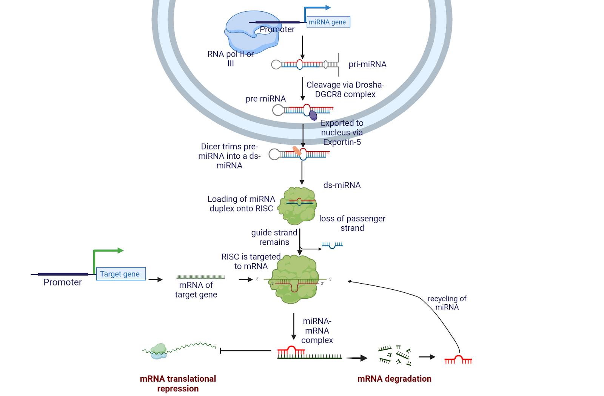
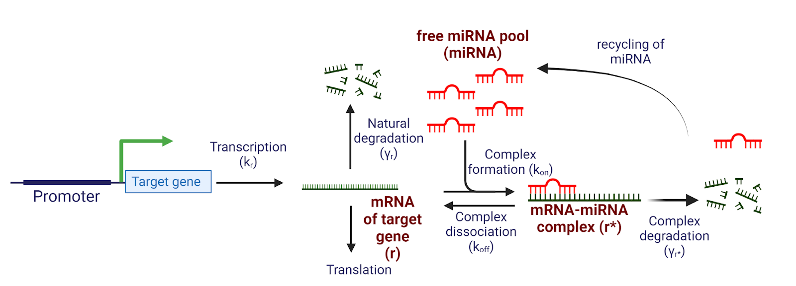

Stochastic Modelling of miRNA-Mediated Gene Noise
================
Caedmon Emery
2025-05-21

- [Background](#background)
- [Model Equations](#model-equations)
- [Packages](#packages)
- [`Stochastic_miRNA_transcription_model.R`](#stochastic_mirna_transcription_modelr)
- [Acknowledgements](#acknowledgements)
- [References](#references)

------------------------------------------------------------------------

# Background

MicroRNAs (miRNAs) are non-coding RNAs that repress gene expression by
targeting mRNA for degradation or translational inhibition. Though often
viewed as buffers of gene expression, this study investigates whether
miRNAs amplify gene expression noise using a stochastic simulation
approach based on work by Mukherji et al. (2011).

  

<figure>

<figcaption aria-hidden="true">Biogenesis of miRNA molecules and
mechanism of gene repression</figcaption>
</figure>

  

# Model Equations

<figure>

<figcaption aria-hidden="true">Graphical Abstract of Model
System</figcaption>
</figure>

  

The system consists of free mRNA (`r`), miRNA (`miRNA`), and their
complex (`r^*`). The governing reactions are:

**1. Free mRNA dynamics:**

$$
\frac{d[r]}{dt} = k_R - \gamma_R * [r] - k_{on} * [miRNA] * [r] + k_{off} * [r^*]
$$

**2. Complex dynamics:**

$$
\frac{d[r^*]}{dt} = k_{on} * [miRNA] * [r] - k_{off} * [r^*] - \gamma_{r^*} * [r^*]
$$

**3. Free miRNA dynamics:**

$$
\frac{d[miRNA]}{dt} = -k_{on} * [miRNA] * [r] + k_{off} * [r^*] + \gamma_{r^*} * [r^*]
$$  

### Model Parameters

| Parameter | Description |
|----|----|
| `k_R` | **Transcription rate** — rate at which free mRNA (`r`) is produced |
| `gamma_R` | **Natural degradation rate** — rate at which free mRNA decays |
| `k_on` | **Association rate** — rate at which free miRNA and mRNA form a complex |
| `k_off` | **Dissociation rate** — rate at which the miRNA–mRNA complex breaks apart |
| `gamma_R_star` | **Complex degradation rate** — rate at which the complex is degraded, releasing miRNA |
| `miRNA_0` | **Initial miRNA pool** — total amount of free miRNA available in the system |

All parameters are in arbitrary units. Only free mRNA (`r`) contributes
to gene expression. Complexed mRNA (`r*`) is translationally inactive.

------------------------------------------------------------------------

# Packages

- `GillespieSSA2`: stochastic simulations via Gillespie algorithm  
- `ggplot2`: visualisation  
- `gridExtra`: multi-panel plot support  
- R version 4.4.1 (2024)

------------------------------------------------------------------------

# `Stochastic_miRNA_transcription_model.R`

This script implements the stochastic model and analysis functions.
Below is an explanation of the functions within the script. Example
outputs will be added at a later date.

  

#### `Gillespie_model(parms)`

Simulates one stochastic trajectory of the system.

**Inputs:** - `parms`: named list with values for  
`k_R`, `k_on`, `k_off`, `gamma_R`, `gamma_R_star`, `miRNA_0`

**Output:** - Data frame of system states over time at steady state

  

#### `Sensitivity_func(parms, parameter, values)`

Explores how varying one parameter affects gene noise.

**Inputs:** - `parms`: named parameter list  
- `parameter`: parameter name (e.g. `"k_R"`)  
- `values`: numeric vector of test values

**Output:** - List containing: - Data frame with gene noise, standard
deviation, mean  
- Threshold value $\theta$

  

#### `variable_miRNA(parms, levels, parameter, values)`

Performs sensitivity analysis across different miRNA pool levels.

**Inputs:** - `parms`: base parameter set  
- `levels`: vector of `miRNA_0` values  
- `parameter`: name of the parameter to vary  
- `values`: test values for the parameter

**Output:** - List of outputs (one per miRNA level)

------------------------------------------------------------------------

# Acknowledgements

This work builds on modelling approaches from Mukherji et al. (2011).
Thanks to Ian Sudbery for project guidance, and the developers of
`GillespieSSA2` for the simulation framework. All biological diagrams
were created using BioRender.com. Permission was granted to upload code
onto personal GitHub as long as the official project write-up was not
included. AI usage: ChatGPT was used to streamline project writeup and
double-checked by author. All work within the code was completed by
Caedmon Emery.

------------------------------------------------------------------------

# References

- Mukherji, S. et al. (2011). MicroRNAs can generate thresholds in
  target gene expression. *Nature Genetics*, 43(9), 854–859.  
- Raser, J.M. and O’Shea, E.K. (2005). Noise in gene expression:
  origins, consequences, and control. *Science*, 309(5743), 2010–2013.  
- Cannoodt, R. et al. (2021). *GillespieSSA2: Gillespie’s Stochastic
  Simulation Algorithm*. CRAN R package.  
- Wickham, H. (2016). *ggplot2: Elegant Graphics for Data Analysis*.  
- Auguie, B. (2017). *gridExtra: Miscellaneous Functions for ‘Grid’
  Graphics*.
